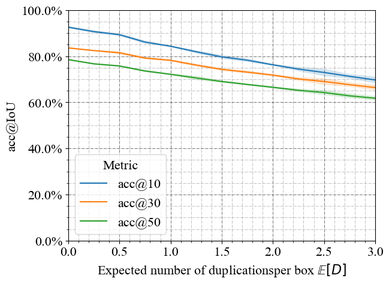

# Robust Detection Outcome (RoDeO)

Official Repository of "Robust Detection Outcome: A Metric for Pathology Detection in Medical Images"
RoDeO is an easy to use object detection metric for applications in medical imaging, such as pathology detection in Chest X-ray images.
It evaluates three sources of errors (**misclassification, faulty localization, and shape mismatch**) separately and combines them to one score.
RoDeO better fulfills requirements in medical applications through its **interpretability**, notion of **proximity** and strong penalization of over- and under-prediction, **encouraging precise models**.


# Installation

RoDeO is available as a python package for python 3.7+ as [rodeo](TODO). To install, simply install it with pip:
```shell
python -m pip install rodeo
```

# Usage

```python
import torch
from rodeo import RoDeO

# Init RoDeO with two classes
rodeo = RoDeO(class_names=['a', 'b'])
# Add some predictions and targets
pred = [torch.tensor([[0.1, 0.1, 0.2, 0.1, 0.0],
                      [0.0, 0.3, 0.1, 0.1, 1.0],
                      [0.2, 0.2, 0.1, 0.1, 0.0]])]
target = [torch.tensor([[0.0, 0.0, 0.1, 0.1, 0.0],
                        [0.0, 0.2, 0.1, 0.1, 1.0]])]
rodeo.add(pred, target)
# Compute the score
score = rodeo.compute()
for key, val in score.items():
    print(f'{key}: {val}')
```

# Advantages of RoDeO

1. AP@IoU benefits from severe overprediction at higher thresholds

 RoDeO | AP@IoU | acc@IoU
:-----:|:------:|:-------:
 |  | 

2. Acc@IoU achieves high scores with underprediction due to the dominance of true negatives

 RoDeO | AP@IoU | acc@IoU
:-----:|:------:|:-------:
 |  | 

3. Compared to threshold-based metrics (like Average Precision @ IoU), RoDeO degrades more gracefully and has a better notion of proximity


 AP@IoU | acc@IoU
:------:|:-------:
 | 

<!-- # Citation
If you use RoDeO in your project, please cite
```
@inproceedings{rodeo-midl2023,
  author    = {Felix Meissen and Philip Müller and Georgios Kaissis and Daniel Rückert},
  title     = {Robust Detection Outcome: A Metric for Pathology Detection in Medical Images.},
  booktitle = {MIDL},
  year      = {2023},
}
``` -->